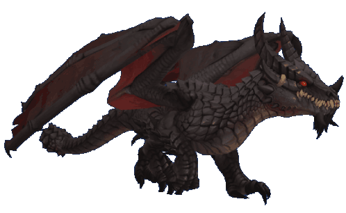

 

 

---

## About Me

Security researcher & focused on offensive security.

Currently working on firmware analysis & exploit.

---

## Tech Stack

 

---

## GitHub Stats

 

<table width="100%" border="0" cellspacing="0" cellpadding="6">
  <tr>
    <td width="50%" align="center">
      
    </td>
    <td width="50%" align="center">
      
    </td>
  </tr>
  <tr>
    <td width="50%" align="center">
      
    </td>
    <td width="50%" align="center">
      
    </td>
  </tr>
</table>

---

## 3D Contribution

 

---

## Profile Summary

 

 

<table width="100%" border="0" cellspacing="0" cellpadding="4">
  <tr>
    <td width="50%" align="center">
      
    </td>
    <td width="50%" align="center">
      
    </td>
  </tr>
</table>

 

---

## Trophies

 

---

## Quote of the Day

 

---

  <picture>
    <source media="(prefers-color-scheme: dark)" srcset="https://raw.githubusercontent.com/SpectreX26999/SpectreX26999/output/github-contribution-grid-snake-dark.svg">
    <source media="(prefers-color-scheme: light)" srcset="https://raw.githubusercontent.com/SpectreX26999/SpectreX26999/output/github-contribution-grid-snake.svg">
    
  </picture>

